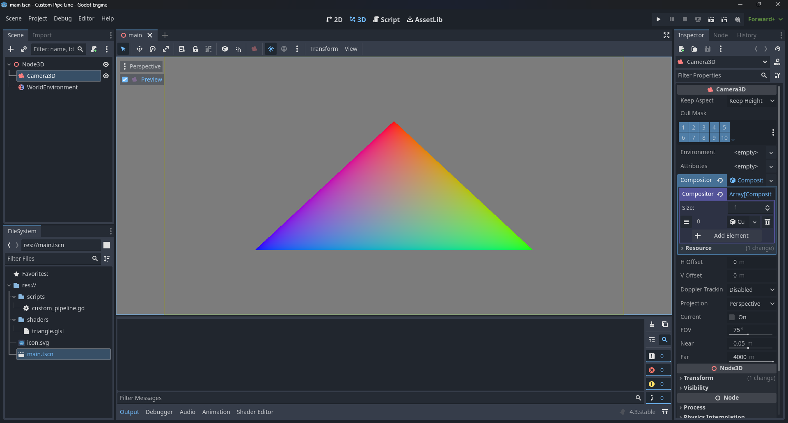

# Customized Render Pipeline

This is a Godot test project that implements a customized render pipeline.

It's based on the triangle example of the Vulkan Tutorial:
https://vulkan-tutorial.com/Drawing_a_triangle/Setup/Base_code

## License

The source in this repository falls under an MIT license (see LICENSE)